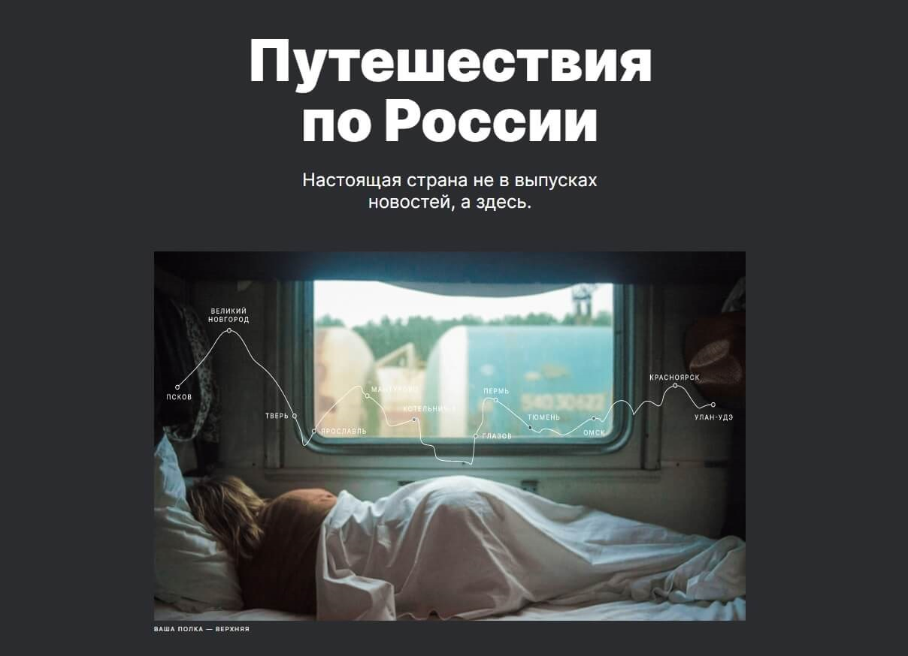

# Путешествия по России &bullet; 

Вёрстка сайта, посвящённого путешествиям по России.

- Файловая структура по БЭМ (Nested)
- Обнуление стилей при помощи normalize.css
- Подключены шрифты через @font-face
- Использованы css-переменные
- Использованы Flex и Grid для построения сеток и выравнивания
- Использованы @media для адаптации под разные разрешения экрана

## Использованные технологии

- HTML5

- CSS3
